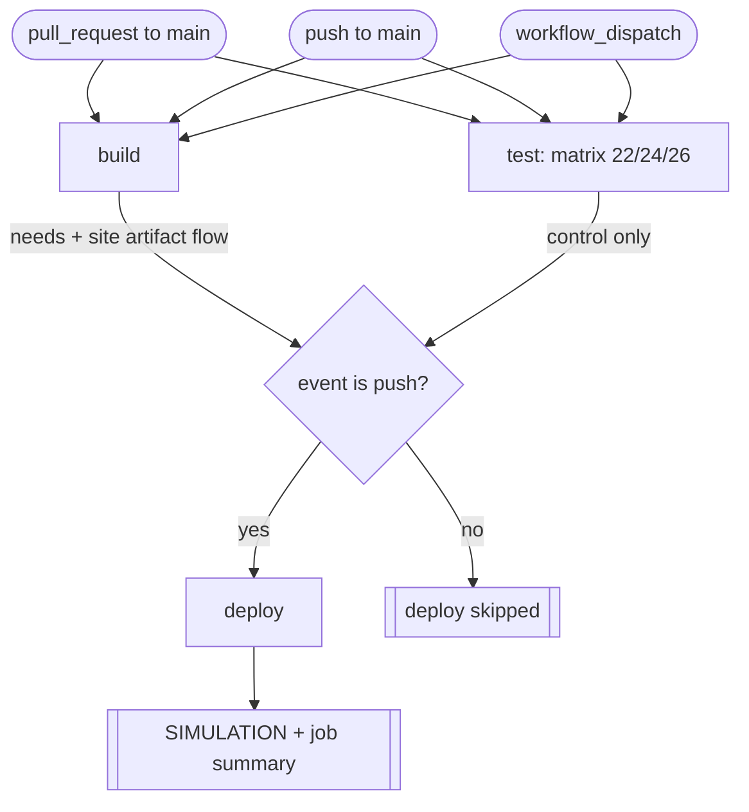

Github Actions Pipeline

```mermaid
flowchart TD
  PR([pull_request to main]) --> B[build]
  PR --> T[test: matrix 22/24/26]
  P([push to main]) --> B
  P --> T
  M([workflow_dispatch]) --> B
  M --> T
  B -- needs + site artifact flow --> G{event is push?}
  T -- control only --> G
  G -- yes --> D[deploy]
  G -- no --> K[[deploy skipped]]
  D --> S[[SIMULATION + job summary]]
```
